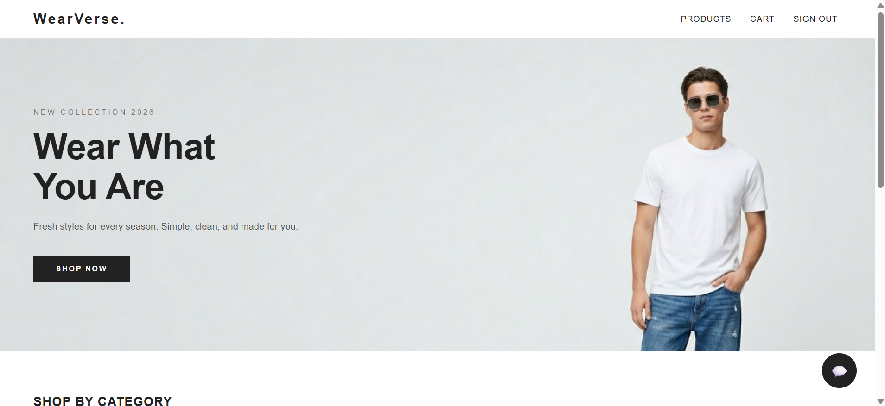
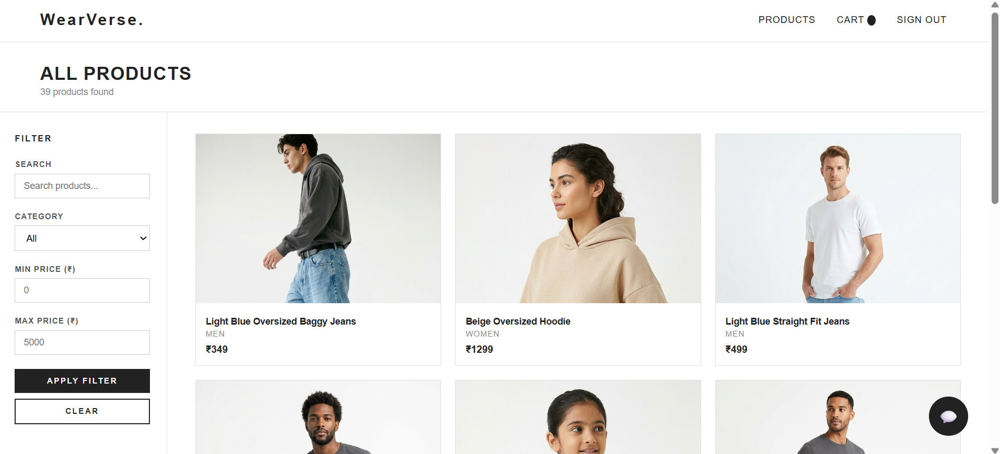
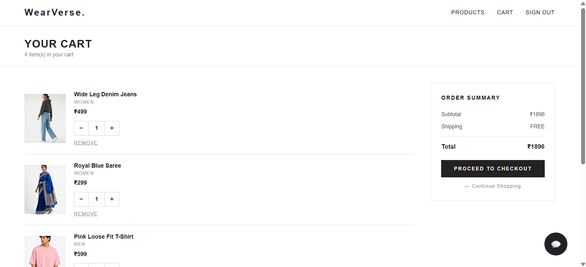
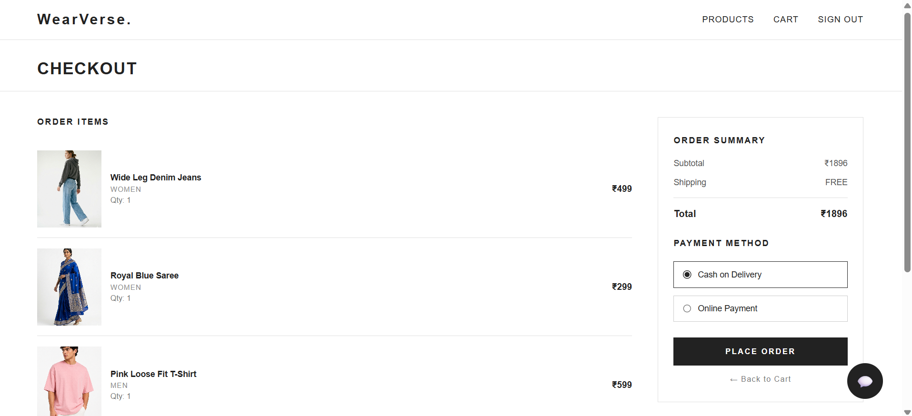

# WearVerse 👕

A full-stack AI-powered clothing ecommerce platform — built as a portfolio project to demonstrate end-to-end full-stack development combined with practical AI/LLM integration.

## Overview

WearVerse is a complete clothing ecommerce web application featuring user authentication, product browsing with filters, a shopping cart and checkout flow, and an intelligent shopping assistant chatbot. The chatbot combines three distinct AI capabilities — natural language product search, an AI agent that can manage orders, and a RAG-based policy assistant — all accessible through a single chat widget on every page.

This project was built iteratively, phase by phase, starting with a hardened FastAPI backend and a complete frontend, then layering in AI features one at a time.

## Features

**Core Ecommerce**
- User registration and login with JWT authentication
- Passwords hashed with bcrypt
- Product browsing with category, price, and name filtering
- Pagination on product listings
- Shopping cart (add, update quantity, remove)
- Checkout flow with order placement
- Order status tracking

**AI Shopping Assistant**
- **Product Search (Query Generator):** Ask in plain English — e.g. "show me jeans under ₹500" — and get matching products, powered by Groq's LLaMA 3.3 model
- **Order Management Agent:** An AI agent (built with LangChain) that can place, cancel, modify, and check the status of orders by reasoning about which backend tool to call
- **Policy Assistant (RAG):** Ask questions about returns, shipping, and privacy policy; answers are retrieved from a policy document using ChromaDB vector search and answered by an LLM

**Frontend**
- Clean, minimal H&M-inspired UI built with plain HTML/CSS/JavaScript
- Seven pages: login, register, home, products, product details, cart, checkout
- Floating chatbot widget present on every page

## Tech Stack

**Backend**
- FastAPI
- MySQL with SQLAlchemy
- JWT authentication (python-jose) + bcrypt password hashing
- Pydantic for request validation

**Frontend**
- HTML, CSS, vanilla JavaScript (no framework)

**AI / LLM**
- Groq API (LLaMA 3.3 70B)
- LangChain & LangGraph (AI agent with tool calling)
- ChromaDB (vector database for RAG)
- PyPDF2 (PDF text extraction)

**Dev Environment**
- Conda, VS Code, Jupyter notebooks (for iterative AI development)

## Project Structure

```
Clothes_Ecommerce/
├── backend/
│   ├── main.py
│   ├── database/
│   ├── models/
│   ├── routers/
│   │   ├── product_routes.py
│   │   ├── customer_routes.py
│   │   ├── order_routes.py
│   │   ├── cart_routes.py
│   │   ├── auth_routes.py
│   │   └── chat_routes.py
│   └── services/
├── frontend/
│   ├── templates/        (login, register, home, products,
│   │                       product_details, cart, checkout)
│   └── static/
│       ├── css/
│       ├── js/
│       └── images/
├── chatbot/
│   ├── query_generator.py    (Phase 5 — product search)
│   ├── agent.py               (Phase 6 — AI order agent)
│   ├── tools.py                (Phase 6 — agent tools)
│   └── rag/
│       ├── basic.py            (RAG — policy assistant)
│       ├── model.py
│       ├── load_documents.py
│       ├── generator.py
│       └── policy.pdf
├── screenshots/
├── requirements.txt
└── README.md
```

## Setup Instructions

**1. Clone the repository**
```bash
git clone <your-repo-url>
cd Clothes_Ecommerce
```

**2. Install dependencies**
```bash
pip install -r requirements.txt
```

**3. Set up MySQL database**
```sql
CREATE DATABASE clothes_ecommerce;
```
Run the table creation scripts for `customers`, `products`, `orders`, `cart`, `transactions`.

**4. Configure environment variables**

Create a `.env` file in the project root:
```
GROQ_API_KEY=your_groq_api_key
USER_TOKEN=your_jwt_token (for AI agent testing)
```

**5. Start the backend**
```bash
uvicorn backend.main:app --reload
```

**6. Open the frontend**

Open `frontend/templates/login.html` with a tool like VS Code Live Server.

**7. Explore the API**

Visit `http://127.0.0.1:8000/docs` for the interactive Swagger UI.

## Screenshots







## Known Limitations / Future Improvements

- Not yet deployed to a live server (currently runs locally)
- No payment gateway integration (checkout uses Cash on Delivery / placeholder online payment)
- Products currently support a single image; multi-color variants and multi-angle product photos (like major retail sites) are planned
- AI agent occasionally requires precise phrasing for tool calls; ongoing refinement of prompts and tool descriptions
- Free-tier LLM API rate limits constrain heavy testing sessions

## Author

Built by Hitesh Sonawane as a portfolio project to demonstrate full-stack development and practical AI/LLM integration skills.

🔗 [LinkedIn](https://www.linkedin.com/in/hitesh-sonawane-014802376)