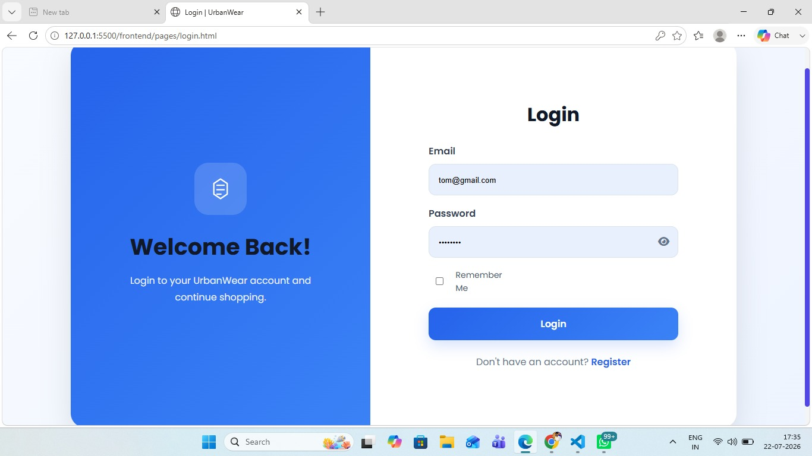
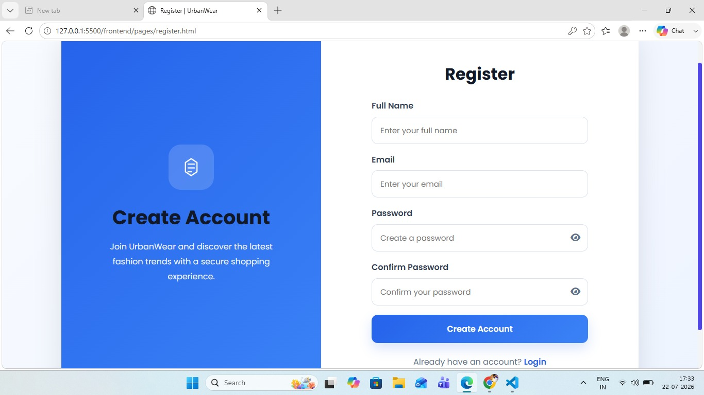
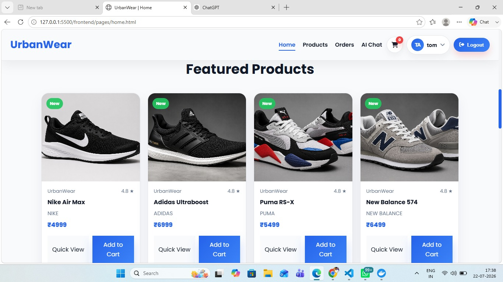
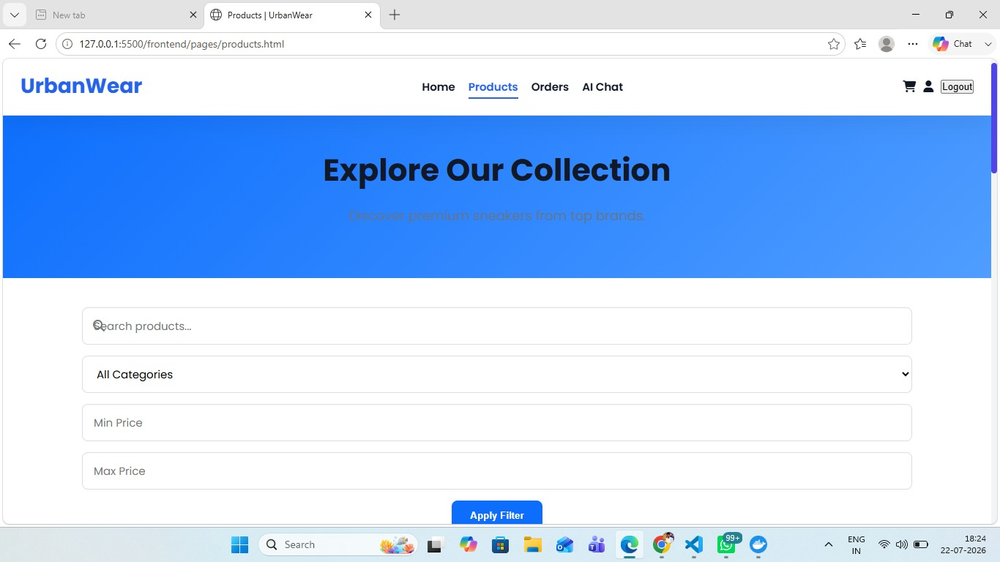
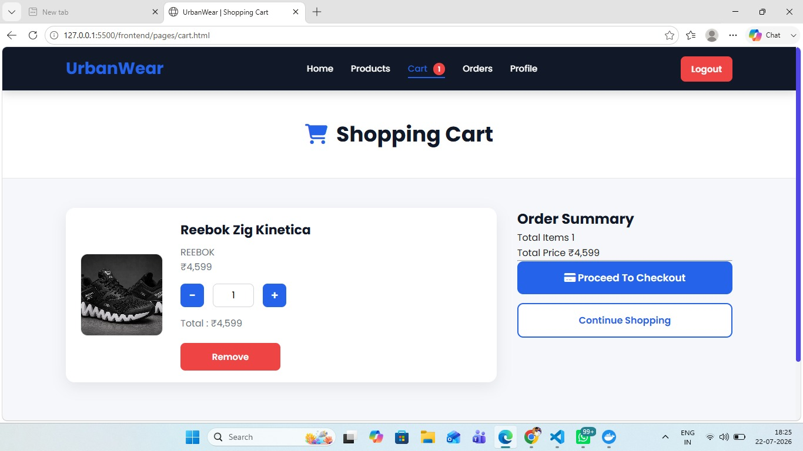
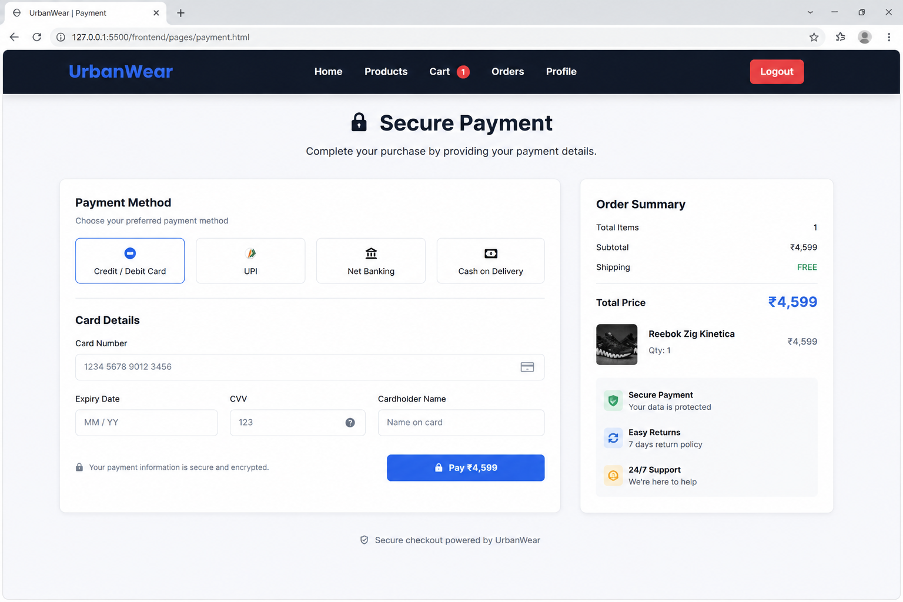
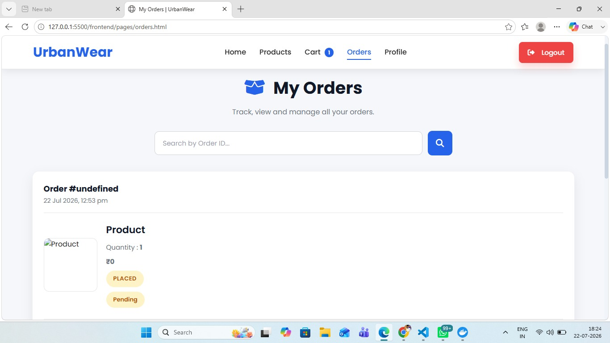
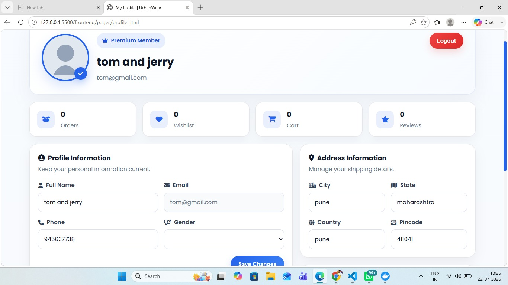

# 👕 UrbanWear - AI Powered Full Stack Fashion E-Commerce

UrbanWear is a modern **Full Stack E-Commerce Platform** built with **FastAPI, MySQL, HTML, CSS, JavaScript, Docker, and Gemini AI**. It provides a complete online shopping experience with secure authentication, shopping cart, order management, user profiles, and AI-powered shopping assistance.

---

## ✨ Features

- 🔐 JWT Authentication
- 👤 User Registration & Login
- 🛍️ Product Catalog
- 🛒 Shopping Cart
- 💳 Secure Payment Page
- 📦 Order Management
- 👤 User Profile
- 🤖 AI Shopping Assistant (Gemini AI)
- 📚 FastAPI Swagger Documentation
- 🐳 Docker Support

---

## 🛠️ Tech Stack

| Frontend | Backend | Database |
|----------|----------|----------|
| HTML5 | FastAPI | MySQL |
| CSS3 | Python | SQLAlchemy |
| JavaScript | JWT | |

---

## 📂 Project Structure

```text
UrbanWear
│
├── backend/
│   ├── auth/
│   ├── database/
│   ├── models/
│   ├── routers/
│   ├── schemas/
│   ├── services/
│   ├── utils/
│   └── main.py
│
├── frontend/
│   ├── assets/
│   │   ├── css/
│   │   ├── js/
│   │   └── images/
│   └── pages/
│       ├── login.html
│       ├── register.html
│       ├── home.html
│       ├── products.html
│       ├── cart.html
│       ├── payment.html
│       ├── orders.html
│       └── profile.html
│
├── sql/
├── docs/
│   └── screenshots/
├── docker-compose.yml
├── Dockerfile
└── README.md
```

---

## 🗄️ Database Structure

```text
Users
│
├── Products
├── Cart
├── Orders
├── Order Items
├── Payments
└── User Profile
```

---

## 📸 Screenshots

| Page | Preview |
|------|---------|
| Login |  |
| Register |  |
| Home |  |
| Featured Products |  |
| Products |  |
| Cart |  |
| Payment |  |
| Orders |  |
| Profile |  |

---

## 🚀 Getting Started

```bash
git clone https://github.com/Siddharth3007Git/UrbanWear-FullStack-Ecommerce.git

cd UrbanWear-FullStack-Ecommerce

docker compose up --build
```

Open:

- Frontend → `http://localhost`
- Swagger → `http://localhost:8000/docs`

---

## 🔮 Future Improvements

- ❤️ Wishlist
- ⭐ Product Reviews
- 📊 Admin Dashboard
- ☁️ Cloud Deployment
- 📱 Mobile Responsive UI
- 🤖 Better AI Recommendations

---

## 👨‍💻 Developer

**Siddharth Jagadale**

📧 **Email:** siddharthjagadale50@gmail.com

🐙 **GitHub:** https://github.com/Siddharth3007Git

💼 **LinkedIn:** https://www.linkedin.com/in/siddharthjagadale?utm_source=share_via&utm_content=profile&utm_medium=member_android

---

⭐ If you like this project, don't forget to **Star** the repository!