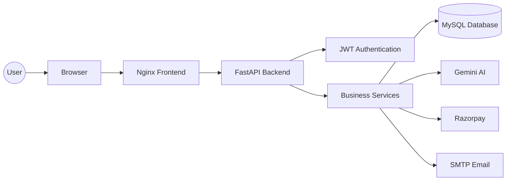
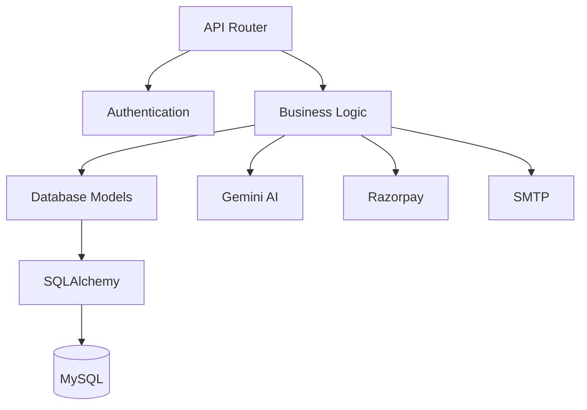
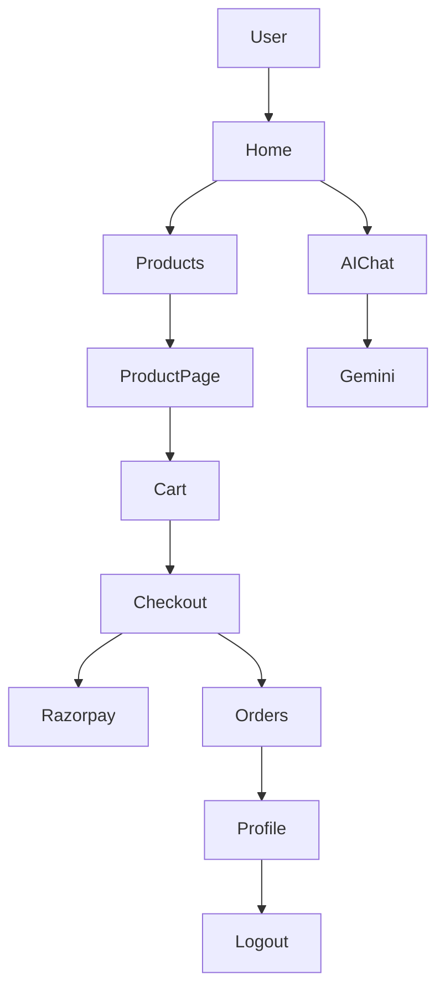
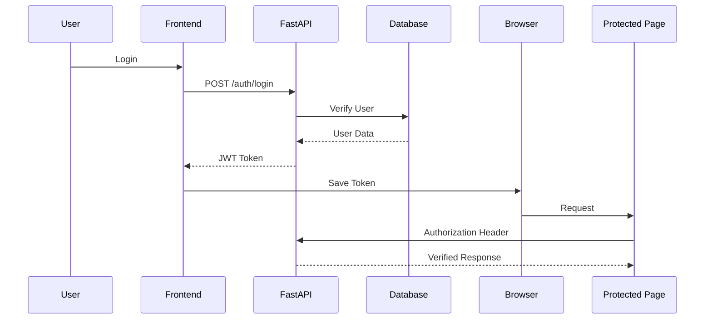
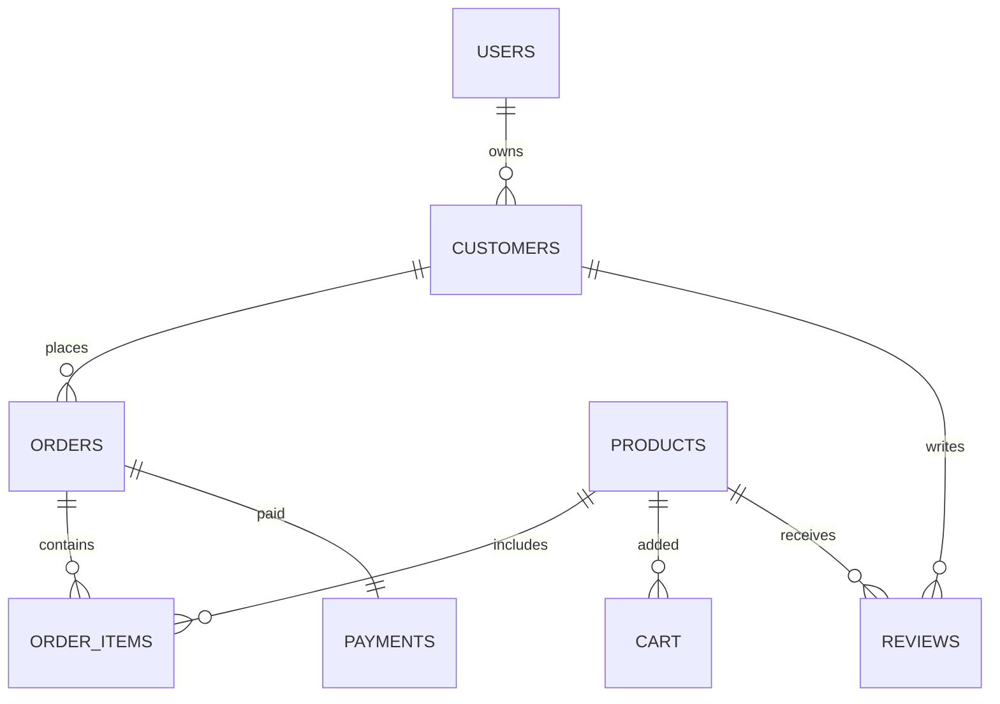
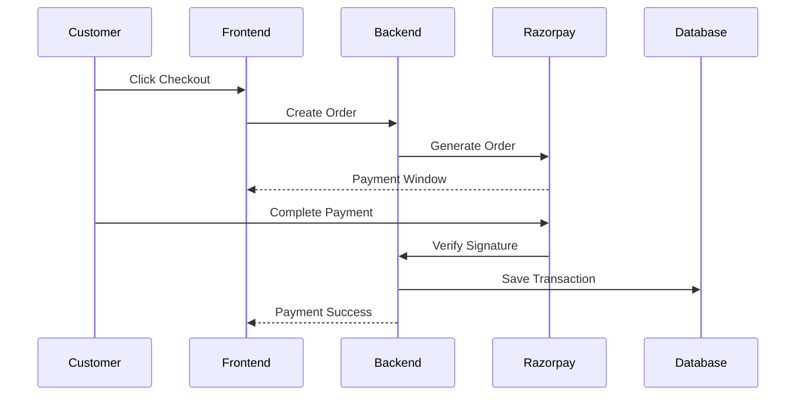
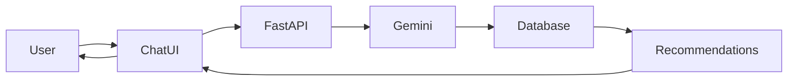
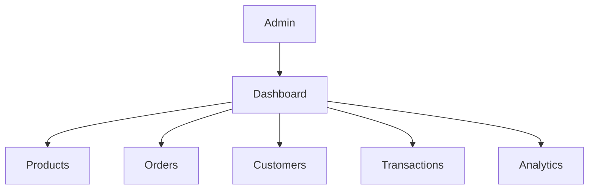
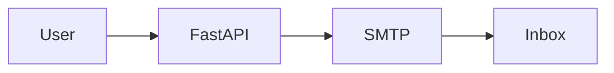

# UrbanWear -- AI Powered Full Stack E-Commerce Platform

> **Professional README Template (Enhanced Version)**

> **Note:** Replace placeholders like `<YOUR_GITHUB_USERNAME>`,
> `<YOUR_REPO_NAME>`, banner image, demo GIF, screenshots, and live demo
> URL with your actual project assets.

```{=html}
<p align="center">
```
``{=html}
```{=html}
</p>
```
```{=html}
<p align="center">
```


```{=html}
</p>
```
```{=html}
<p align="center">
```
An AI-powered Full Stack Fashion E-Commerce Platform built with
`<b>`{=html}FastAPI`</b>`{=html}, `<b>`{=html}MySQL`</b>`{=html},
`<b>`{=html}Docker`</b>`{=html}, `<b>`{=html}Nginx`</b>`{=html},
`<b>`{=html}Gemini AI`</b>`{=html}, and
`<b>`{=html}Razorpay`</b>`{=html}.
```{=html}
</p>
```

------------------------------------------------------------------------

# ✨ Project Highlights

-   🤖 AI Shopping Assistant (Gemini AI)
-   🔐 JWT Authentication & Role-Based Authorization
-   🛒 Complete Shopping Cart & Checkout
-   💳 Razorpay Integration
-   📦 Order Management
-   👤 User Profiles
-   📧 Email Notifications
-   📊 Admin Dashboard
-   🐳 Dockerized Deployment
-   ⚡ FastAPI REST API

# 🚀 Why UrbanWear?

UrbanWear combines a modern FastAPI backend, lightweight frontend,
AI-powered shopping assistant, secure authentication, Docker deployment,
and payment integration into a single production-style learning project.
It demonstrates backend architecture, API design, authentication, DevOps
basics, and AI integration in one repository.

# 🛠 Tech Stack

  Layer        Technology
  ------------ ------------------------
  Backend      FastAPI, SQLAlchemy
  Frontend     HTML, CSS, JavaScript
  Database     MySQL
  AI           Gemini AI
  Payments     Razorpay
  Web Server   Nginx
  DevOps       Docker, Docker Compose

# 📂 Project Structure

``` text
backend/
frontend/
sql/
docs/
docker-compose.yml
Dockerfile
README.md
```

# 🏗 Architecture

Keep your existing Mermaid diagrams here.

# 🔐 Authentication

-   JWT Login
-   Protected Routes
-   Role-based Access
-   Secure Password Hashing

# 🤖 AI Features

-   Product Recommendations
-   Shopping Assistant
-   Category Search
-   Natural Language Queries

# 💳 Payments

-   Razorpay Order Creation
-   Payment Verification
-   Order Tracking

# 🐳 Docker

``` bash
docker compose up --build
```

# ⚙ Environment Variables

Keep your existing environment variable table.

# 📸 Screenshots

Replace with real screenshots.

``` md


```

# 🎥 Demo

``` md


Download Video:
docs/demo.mp4
```

# 📈 Future Improvements

-   CI/CD
-   Unit Tests
-   Cloud Deployment
-   Analytics
-   Recommendation Improvements

# 🤝 Contributing

Fork → Branch → Commit → Pull Request

# 📄 License

MIT License (replace if using another license).

# 👨‍💻 Author

**Siddharth Jagadale**

GitHub: https://github.com/Siddharth3007Git

LinkedIn: `<ADD_LINKEDIN>`{=html}

Email: siddharthjagadale50@gmail.com

# 📊 GitHub Stats

Replace `<YOUR_GITHUB_USERNAME>`:

``` md


```

------------------------------------------------------------------------

```{=html}
<p align="center">
```
Built with ❤️ using FastAPI, Docker, MySQL, Gemini AI, and Razorpay.
```{=html}
</p>
```
# 👕 UrbanWear – AI Powered Full Stack Fashion E-Commerce Platform

<p align="center">
  
</p>

<p align="center">

<a href="#-installation">

</a>

<a href="#-api-documentation">

</a>

<a href="docs/demo.mp4">

</a>

<a href="../../issues">

</a>

<a href="../../issues/new">

</a>

</p>

<p align="center">


</p>

---

## 🌟 Overview

UrbanWear is an **AI-powered Full Stack Fashion E-Commerce Platform** that combines a modern FastAPI backend with a responsive frontend, secure JWT authentication, MySQL database, Docker deployment, Razorpay payment integration, and Google's Gemini AI to deliver an intelligent online shopping experience.

The project demonstrates real-world backend architecture, REST API development, authentication, AI integration, payment processing, and scalable deployment practices.

---

# 🚀 Why UrbanWear?

Unlike a traditional CRUD e-commerce project, UrbanWear focuses on building a production-inspired architecture with modern technologies.

### Key differentiators

- 🤖 AI-powered shopping assistant using Gemini AI
- 🔐 Secure JWT Authentication
- 🛍️ Complete shopping workflow
- 💳 Razorpay Payment Gateway
- 📦 Order Management
- 📧 Email Notification System
- 🐳 Dockerized Deployment
- 🌐 Nginx Reverse Proxy
- 📊 Admin Dashboard
- 📈 Clean REST API Architecture
- 🧩 Modular FastAPI Design
- ⚡ Production-ready project structure

---

# ✨ Project Highlights

| Feature | Status |
|----------|--------|
| AI Shopping Assistant | ✅ |
| JWT Authentication | ✅ |
| Product Management | ✅ |
| Shopping Cart | ✅ |
| Checkout | ✅ |
| Razorpay Integration | ✅ |
| Order Tracking | ✅ |
| User Profile | ✅ |
| Admin Dashboard | ✅ |
| Email Notifications | ✅ |
| Docker Deployment | ✅ |
| REST API | ✅ |
| Swagger Documentation | ✅ |
| Responsive Frontend | ✅ |

---

## 🎯 Project Goals

- Build a scalable FastAPI backend
- Implement secure authentication
- Integrate AI for better shopping assistance
- Provide seamless payment experience
- Demonstrate production-ready architecture
- Follow clean coding practices
- Learn DevOps using Docker
# 🛠️ Tech Stack

<div align="center">

| Category | Technologies |
|-----------|--------------|
| **Backend** | FastAPI, Python, SQLAlchemy |
| **Frontend** | HTML5, CSS3, JavaScript |
| **Database** | MySQL 8 |
| **Authentication** | JWT, bcrypt, python-jose |
| **AI Integration** | Google Gemini AI |
| **Payments** | Razorpay |
| **Email Service** | SMTP |
| **Web Server** | Nginx |
| **Containerization** | Docker, Docker Compose |
| **API Documentation** | Swagger UI, ReDoc |
| **Version Control** | Git & GitHub |

</div>

---

# 📂 Project Structure

```text
UrbanWear
│
├── backend/
│   ├── ai/
│   ├── auth/
│   ├── database/
│   ├── email/
│   ├── middleware/
│   ├── models/
│   ├── routers/
│   ├── schema/
│   ├── services/
│   ├── utils/
│   ├── uploads/
│   ├── static/
│   ├── requirements.txt
│   └── main.py
│
├── frontend/
│   ├── assets/
│   │   ├── css/
│   │   ├── js/
│   │   ├── images/
│   │   └── icons/
│   │
│   ├── pages/
│   │   ├── admin/
│   │   ├── customer/
│   │   └── auth/
│   │
│   ├── index.html
│   └── nginx.conf
│
├── docs/
│   ├── screenshots/
│   ├── diagrams/
│   └── demo.gif
│
├── sql/
│   └── schema.sql
│
├── Dockerfile
├── docker-compose.yml
├── .dockerignore
├── .env.example
├── LICENSE
└── README.md
```

---

# 🏗️ System Architecture



---

# ⚙️ Backend Architecture



---

# 🖥️ Frontend Architecture



---

# 🔐 Authentication Flow



---

# 💾 Database Overview

### Main Tables

- Users
- Customers
- Products
- Categories
- Cart
- Orders
- Order Items
- Transactions
- Payments
- Reviews

### Relationships



---

# 📈 Project Workflow

```text
User Login
      │
      ▼
Browse Products
      │
      ▼
Product Details
      │
      ▼
Add to Cart
      │
      ▼
Checkout
      │
      ▼
Payment Gateway
      │
      ▼
Order Created
      │
      ▼
Email Notification
      │
      ▼
Order Tracking
```
# 📚 API Documentation

UrbanWear provides a well-structured REST API built using **FastAPI**.

## Interactive API Documentation

| Documentation | URL |
|---------------|-----|
| Swagger UI | http://localhost:8000/docs |
| ReDoc | http://localhost:8000/redoc |

---

# 📌 API Modules

| Module | Description |
|----------|-------------|
| Authentication | Register, Login, JWT Authentication |
| Products | Product CRUD Operations |
| Categories | Product Categories |
| Cart | Shopping Cart Management |
| Orders | Order Processing |
| Payments | Razorpay Integration |
| Profile | User Profile |
| Customers | Customer Management |
| Admin | Dashboard & Analytics |
| AI Chat | Gemini AI Assistant |
| Recommendation | Personalized Product Recommendation |
| Email | Notification Service |

---

# 🔑 Authentication APIs

| Method | Endpoint | Description |
|---------|----------|-------------|
| POST | `/auth/register` | Register new customer |
| POST | `/auth/login` | Login user |
| POST | `/auth/logout` | Logout user |
| GET | `/auth/me` | Current logged-in user |

---

# 👕 Product APIs

| Method | Endpoint |
|---------|----------|
| GET | `/products` |
| GET | `/products/{id}` |
| POST | `/products` |
| PUT | `/products/{id}` |
| DELETE | `/products/{id}` |

### Features

- Product Search
- Category Filter
- Price Filter
- Pagination
- Sorting
- Stock Validation
- Product Images

---

# 🛒 Cart APIs

| Method | Endpoint |
|---------|----------|
| GET | `/cart` |
| POST | `/cart` |
| PUT | `/cart/{id}` |
| DELETE | `/cart/{id}` |
| DELETE | `/cart/clear` |

### Cart Features

- Add Product
- Update Quantity
- Remove Product
- Clear Cart
- Calculate Total
- User Specific Cart

---

# 📦 Order APIs

| Method | Endpoint |
|---------|----------|
| GET | `/orders` |
| GET | `/orders/{id}` |
| POST | `/orders` |
| DELETE | `/orders/{id}` |

### Order Features

- Place Order
- View Order History
- Order Tracking
- Cancel Order
- Payment Status
- Invoice Generation (Future)

---

# 💳 Payment APIs

| Method | Endpoint |
|---------|----------|
| POST | `/payment/create-order` |
| POST | `/payment/verify` |

---

## 💳 Razorpay Payment Workflow



---

# 🤖 AI Shopping Assistant

UrbanWear integrates **Google Gemini AI** to improve the shopping experience.

## AI Capabilities

- Product Recommendation
- Fashion Suggestions
- Category Search
- Color Matching
- Size Guidance
- Shopping Conversation
- Similar Product Discovery

---

## AI Workflow



---

# 👤 User Profile

Users can manage their account securely.

### Features

- View Profile
- Edit Profile
- Change Password
- Order History
- Saved Address
- Account Settings

---

# 👨‍💼 Admin Dashboard

Administrators have complete control over the platform.

## Dashboard Features

- Total Customers
- Total Orders
- Total Revenue
- Daily Sales
- Monthly Sales
- Product Management
- Customer Management
- Transaction Monitoring
- Low Stock Products
- Best Selling Products

---

## Admin Workflow



---

# 📧 Email Notification System

UrbanWear automatically sends transactional emails.

## Email Types

- Welcome Email
- Order Confirmation
- Payment Success
- Password Reset
- Account Verification (Future)

---

## Email Flow



---

# 🔒 Security Features

- JWT Authentication
- Password Hashing (bcrypt)
- Role-Based Authorization
- Secure API Endpoints
- SQLAlchemy ORM
- Input Validation (Pydantic)
- CORS Protection
- Environment Variables
- Docker Isolation
- Secure Payment Verification

---

# ⚡ Performance Features

- FastAPI Async Support
- Optimized SQL Queries
- Lazy Loading
- Modular Architecture
- Docker Deployment
- Nginx Reverse Proxy
- Stateless REST API
- Scalable Folder Structure
# 🐳 Docker Deployment

UrbanWear is fully containerized using **Docker** and **Docker Compose**, making it easy to run the complete application with a single command.

## Services

| Service | Description |
|----------|-------------|
| Backend | FastAPI Application |
| Frontend | Nginx Static Server |
| Database | MySQL 8 |
| Volume | Persistent Database Storage |

---

## Start Application

```bash
docker compose up --build
```

---

## Stop Application

```bash
docker compose down
```

---

## Remove Containers + Database

```bash
docker compose down -v
```

---

# ⚙️ Local Installation

## 1️⃣ Clone Repository

```bash
git clone https://github.com/Siddharth3007Git/UrbanWear.git

cd UrbanWear
```

---

## 2️⃣ Create Virtual Environment

```bash
python -m venv venv
```

---

## 3️⃣ Activate Environment

### Windows

```bash
venv\Scripts\activate
```

### Linux / macOS

```bash
source venv/bin/activate
```

---

## 4️⃣ Install Dependencies

```bash
pip install -r backend/requirements.txt
```

---

## 5️⃣ Configure Environment Variables

Create a `.env` file in the project root.

Example:

```env
DB_HOST=mysql
DB_PORT=3306
DB_NAME=clothes_ecommerce
DB_USER=root
DB_PASSWORD=root

SECRET_KEY=your_secret_key
ALGORITHM=HS256
ACCESS_TOKEN_EXPIRE_MINUTES=30

GEMINI_API_KEY=your_api_key

RAZORPAY_KEY_ID=your_key
RAZORPAY_KEY_SECRET=your_secret

SMTP_SERVER=smtp.gmail.com
SMTP_PORT=587
SMTP_EMAIL=example@gmail.com
SMTP_PASSWORD=your_password
```

---

## 6️⃣ Run Backend

```bash
uvicorn backend.main:app --reload
```

---

## 7️⃣ Open Application

| Service | URL |
|----------|-----|
| Frontend | http://localhost |
| FastAPI | http://localhost:8000 |
| Swagger | http://localhost:8000/docs |
| ReDoc | http://localhost:8000/redoc |

---

# 📸 Application Screenshots

> Replace the placeholder images with actual screenshots from your project.

## 🏠 Home Page

```md

```

---

## 👕 Products Page

```md

```

---

## 🛒 Shopping Cart

```md

```

---

## 💳 Checkout

```md

```

---

## 🤖 AI Shopping Assistant

```md

```

---

## 👨‍💼 Admin Dashboard

```md

```

---

## 📚 Swagger Documentation

```md

```

---

# 🎥 Demo

## Demo GIF

```md

```

---

## Demo Video

```text
docs/demo.mp4
```

---

# 🚀 Future Roadmap

- Cloud Deployment (AWS / Azure / GCP)
- Kubernetes Support
- CI/CD with GitHub Actions
- Product Reviews & Ratings
- Wishlist
- Coupon System
- Inventory Management
- Analytics Dashboard
- AI Outfit Recommendations
- Voice Shopping Assistant
- Multi-language Support
- Dark Mode
- Progressive Web App (PWA)
- Mobile Application

---

# 🧪 Testing

Future improvements include:

- Unit Tests
- Integration Tests
- API Tests
- Load Testing
- Security Testing

---

# 🤝 Contributing

Contributions are welcome!

1. Fork this repository
2. Create a feature branch

```bash
git checkout -b feature/new-feature
```

3. Commit your changes

```bash
git commit -m "Add new feature"
```

4. Push to GitHub

```bash
git push origin feature/new-feature
```

5. Open a Pull Request

---

# 📄 License

This project is licensed under the **MIT License**.

If you choose a different license, update this section and include a `LICENSE` file in the repository root.

---

# 👨‍💻 Author

<div align="center">

## Siddharth Jagadale

**Information Technology Student**  
**Python Developer**  
**FastAPI Developer**  
**AI & Machine Learning Enthusiast**

📧 siddharthjagadale50@gmail.com

🐙 GitHub:
https://github.com/Siddharth3007Git

💼 LinkedIn:
https://www.linkedin.com/in/YOUR-LINKEDIN-USERNAME

</div>

---

# 📊 GitHub Stats

> Replace `Siddharth3007Git` if your GitHub username changes.

```md


```

---

# 🌟 Support

If you found this project helpful:

⭐ Star the repository

🍴 Fork the repository

🛠️ Contribute improvements

📢 Share it with others

---

<div align="center">

## ❤️ Thank You for Visiting

**Built with FastAPI, Docker, MySQL, Gemini AI, and Razorpay**

⭐ If you like this project, don't forget to **Star** the repository!

</div>
# 📌 Repository Badges


