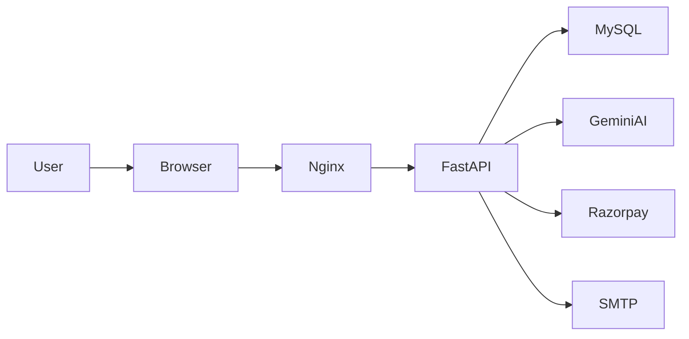

# 👕 UrbanWear -- AI Powered Full Stack Fashion E-Commerce Platform

```{=html}
<p align="center">
```
``{=html}
```{=html}
</p>
```
```{=html}
<p align="center">
```
``{=html}
``{=html}
``{=html}
``{=html}
``{=html}
``{=html}
``{=html}
``{=html}
```{=html}
</p>
```
## 🌟 Overview

UrbanWear is an AI-powered full-stack fashion e-commerce platform built
with **FastAPI**, **MySQL**, **Docker**, **Nginx**, **JWT
Authentication**, **Google Gemini AI**, and **Razorpay**. It
demonstrates production-inspired backend architecture, secure
authentication, REST APIs, AI integration, and containerized deployment.

## ✨ Features

-   🔐 JWT Authentication
-   👕 Product Management
-   🛒 Shopping Cart
-   💳 Razorpay Payments
-   📦 Order Management
-   🤖 Gemini AI Shopping Assistant
-   👤 User Profiles
-   📧 Email Notifications
-   👨‍💼 Admin Dashboard
-   🐳 Docker Deployment
-   📚 Swagger & ReDoc API Docs

## 🛠 Tech Stack

  Layer      Technologies
  ---------- -------------------------------
  Backend    FastAPI, Python, SQLAlchemy
  Frontend   HTML, CSS, JavaScript
  Database   MySQL
  AI         Gemini AI
  Payments   Razorpay
  DevOps     Docker, Docker Compose, Nginx

## 📂 Project Structure

``` text
UrbanWear/
├── backend/
├── frontend/
├── docs/
├── sql/
├── Dockerfile
├── docker-compose.yml
├── .env.example
└── README.md
```

## 🏗 Architecture



## 📚 API Documentation

  Docs      URL
  --------- -----------------------------
  Swagger   http://localhost:8000/docs
  ReDoc     http://localhost:8000/redoc

### Main APIs

-   Authentication
-   Products
-   Cart
-   Orders
-   Payments
-   Profile
-   Admin
-   AI Assistant

## 🐳 Docker

``` bash
docker compose up --build
```

## ⚙ Installation

``` bash
git clone https://github.com/Siddharth3007Git/UrbanWear.git
cd UrbanWear
python -m venv venv
pip install -r backend/requirements.txt
uvicorn backend.main:app --reload
```

## 🌍 Environment Variables

``` env
DB_HOST=mysql
DB_PORT=3306
DB_NAME=clothes_ecommerce
DB_USER=root
DB_PASSWORD=root

SECRET_KEY=your_secret_key
GEMINI_API_KEY=your_api_key
RAZORPAY_KEY_ID=your_key
RAZORPAY_KEY_SECRET=your_secret
```

## 📸 Screenshots

Replace these placeholders with project screenshots.

-   Home
-   Products
-   Cart
-   Checkout
-   Admin Dashboard
-   Swagger UI

## 🚀 Future Roadmap

-   CI/CD
-   Kubernetes
-   Analytics
-   Wishlist
-   Reviews
-   Mobile App
-   PWA

## 🤝 Contributing

1.  Fork
2.  Create a branch
3.  Commit
4.  Push
5.  Open a Pull Request

## 📄 License

MIT License

## 👨‍💻 Author

**Siddharth Jagadale**

-   GitHub: https://github.com/Siddharth3007Git
-   Email: siddharthjagadale50@gmail.com
-   LinkedIn: https://www.linkedin.com/in/siddharthjagadale/

## ⭐ Support

If you found this project useful, please consider starring the
repository.

------------------------------------------------------------------------

Built with ❤️ using FastAPI, Docker, MySQL, Gemini AI, and Razorpay.
